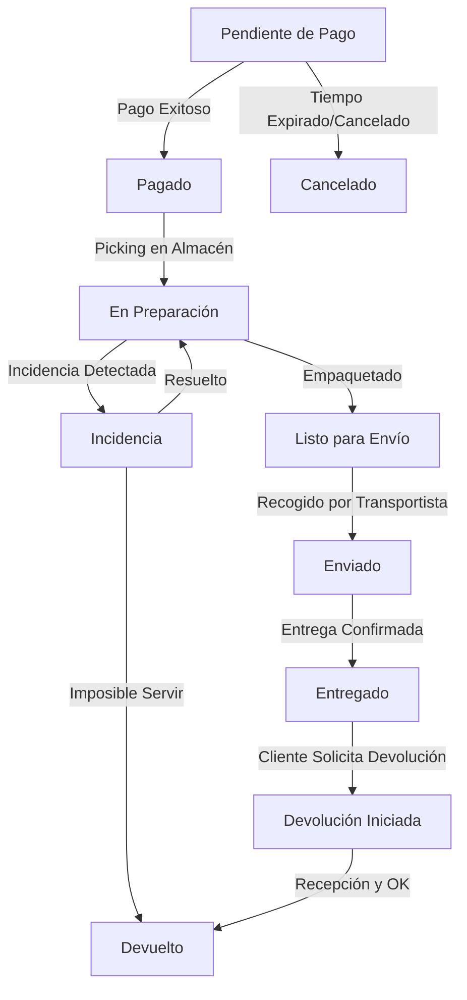

# Especificación de E-commerce y Gestión de Pedidos

Este documento detalla la lógica de negocio, flujos operativos y especificaciones técnicas para el módulo de comercio electrónico de Mr. CoolCat, integrando las definiciones del *Backoffice* y el *Design System*.

## 1. Flujo de Vida del Pedido (Order Pipeline)

El sistema gestiona los pedidos a través de una máquina de estados finitos. Cada transición debe ser registrada en el `audit_log`.

### A. Diagrama de Estados

### B. Definición de Estados
1.  **Pendiente de Pago (`pending_payment`):** El pedido se ha creado en base de datos pero no hay confirmación de la pasarela. El stock se reserva temporalmente (TTL: 15-30 min).
2.  **Pagado (`paid`):** Confirmación financiera recibida. Se genera la factura/albarán automáticamente. El stock se descuenta definitivamente.
3.  **En Preparación (`processing`):** El equipo de almacén ha comenzado el proceso de *picking*.
4.  **Listo para Envío (`ready_for_shipping`):** El paquete está cerrado, pesado y con la etiqueta de envío pegada.
5.  **Enviado (`shipped`):** El paquete ha sido escaneado por el transportista. Se dispara la notificación al usuario con el *Tracking Number*.
6.  **Entregado (`delivered`):** El transportista confirma la entrega. Se activan disparadores de fidelización (puntos por compra).
7.  **Incidencia (`on_hold`):** Estado manual o automático (ej. dirección inválida). Detiene el cronómetro de SLA.
8.  **Cancelado (`cancelled`):** Fin del flujo sin envío. Si hubo pago, implica reembolso automático.

---

## 2. Logística y Configuración de Envíos

El sistema debe permitir una configuración flexible de zonas y costes para adaptarse a la realidad logística.

### A. Zonas de Envío (Shipping Zones)
Configuración regional editable desde el Backoffice:
*   **Nacional Península:** Zona por defecto.
*   **Baleares y Canarias:** Tarifas especiales y tiempos de tránsito extendidos.
*   **Internacional (EU):** Países habilitados específicamente.
*   **Restricciones:** Capacidad de bloquear zonas por tipo de producto (ej. Alcohol no permitido en ciertas regiones).

### B. Reglas de Tarifas (Shipping Rules)
Cálculo en tiempo real en el carrito (`CartService`):
1.  **Coste Base:** Precio fijo asignado a cada zona (ej. 5,95€).
2.  **Regla de Gratuidad:** `IF Cart.Total >= FreeShippingThreshold THEN ShippingCost = 0`.
    *   El umbral (ej. 35€) debe ser una variable editable en la configuración global (`app_settings`).
3.  **Suplementos (Opcional):** Coste extra por peso total > X kg (calculado sumando el peso de `product_variants`).

### C. Integración de Transportistas
*   **Campo Tracking:** Input de texto en el detalle del pedido para introducir el código de seguimiento.
*   **Link Dinámico:** El sistema debe construir la URL de seguimiento basada en el transportista seleccionado (Correos, Seur, DHL) para mostrarla en la App del cliente:
    *   `https://track.carrier.com?code={tracking_number}`

---

## 3. Recuperación de Carritos (Cart Recovery)

Estrategia para maximizar la conversión recuperando ventas potenciales perdidas.

### A. Identificación de Carritos Abandonados
Un carrito se marca como "Abandonado" si cumple todas las condiciones:
1.  No está vacío (`items.length > 0`).
2.  No tiene una orden asociada (`order_id IS NULL`).
3.  Última modificación hace > 1 hora y < 48 horas.

### B. Acciones de Recuperación
El módulo debe permitir acciones manuales y automatizadas:
1.  **Listado Priorizado:** Vista en Backoffice ordenada por valor del carrito (Mayor valor primero).
2.  **Notificaciones Push / Email:**
    *   **Trigger:** Tarea programada (Cron) cada hora.
    *   **Contenido:** "¡Hey [Nombre], tus cervezas te esperan! 🍺".
    *   **Deep Link:** Al pulsar, abre la App directamente en la pantalla de Checkout con el carrito cargado.
3.  **Incentivos (Marketing):** Posibilidad de adjuntar un cupón de descuento automático (ej. 5%) si es la primera vez que abandona.

---

## 4. Interfaz de Gestión (UI/UX)

Siguiendo el **Design System** (`DESIGN_SYSTEM.md`), la interfaz del Backoffice para pedidos debe facilitar la lectura rápida.

### A. Códigos de Color (Visual Status)
Uso de "Badges" o píldoras de estado en los listados:
*   **Verde (`#4CAF50`):** Pagado, Entregado.
*   **Azul / Índigo (`#6366F1`):** Enviado.
*   **Naranja (`#F76934`):** Pendiente, En Preparación.
*   **Rojo (`#FF6B6B` / `#DC2626`):** Cancelado, Incidencia, Devuelto.
*   **Gris (`#9CA3AF`):** Carrito Abandonado (Expirado).

### B. Componentes Clave
*   **Detalle del Pedido (Card):** Fondo `#2C2C2C` con bordes redondeados. Información del cliente y dirección a la izquierda, lista de items a la derecha.
*   **Timeline de Actividad:** Componente vertical mostrando el historial de cambios de estado (Quién y Cuándo).
*   **Botones de Acción:**
    *   Primario (Naranja): "Marcar como Enviado", "Generar Etiqueta".
    *   Secundario (Outline): "Descargar Factura", "Ver Perfil Cliente".
    *   Peligro (Texto Rojo): "Cancelar Pedido".

---

## 5. Entidades de Datos (Esquema Relacional)

Estructura necesaria para soportar el módulo:

*   `orders`: Cabecera del pedido (ID, UserID, Status, Total, ShippingAddressJSON, TrackingNumber, CreatedAt).
*   `order_items`: Líneas de detalle (OrderID, ProductVariantID, Quantity, PriceAtPurchase).
*   `shipping_zones`: Configuración (ID, Name, BaseCost, FreeShippingThreshold, RegionCodes).
*   `carts`: Persistencia de carritos (ID, UserID, ItemsJSON, LastActiveAt, IsAbandoned).
*   `audit_logs`: Trazabilidad (AdminID, Action, ResourceID, ChangesJSON).
