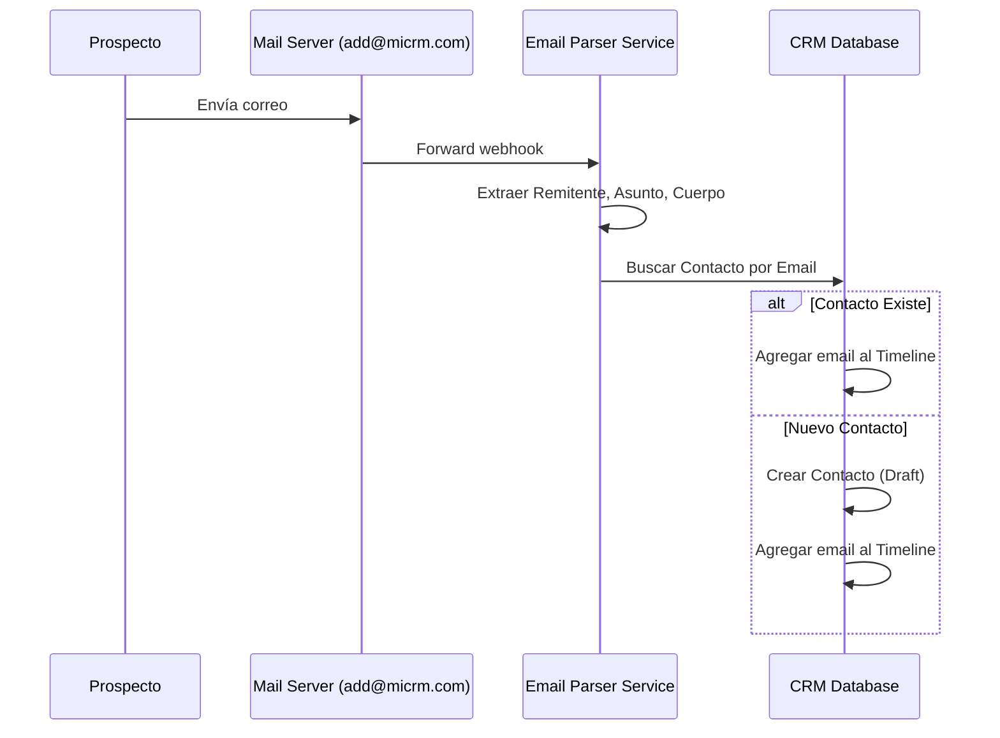

# CRM Inteligente & Pipeline Visual

## Descripción General
**Módulo 1** del sistema operativo para freelancers.
**Objetivo:** Asegurar el seguimiento efectivo de clientes y prospectos para maximizar las oportunidades de venta.
**Visión:** "Que nunca pierdas dinero por olvidar hacer seguimiento."

---

## Flujos y Lógica Visual

### Lógica de "Rotting" (Podredumbre)
El sistema prioriza visualmente la atención basándose en la inactividad. Una tarjeta "se pudre" si no recibe atención.

```mermaid
graph TD
    A[Tarjeta entra en estado 'Contactado'] --> B{Han pasado 7 días?}
    B -- No --> C[Estado Normal (Blanco/Gris)]
    B -- Sí --> D{Han pasado 14 días?}
    D -- No --> E[Estado Advertencia (Amarillo)]
    D -- Sí --> F[Estado Crítico (Rojo)]
    
    E --> G[Actividad Registrada (Email/Nota)]
    F --> G
    C --> G
    G --> A[Reinicio del Timer]
```

### Flujo de Lead Capture (Email Parser)



---

## Definición de Datos (TypeScript Interfaces)

Estas interfaces deben ser implementadas en `src/features/crm/types/index.ts`.

### Entidad `Contact`
Representa a una persona o empresa en el sistema.

```typescript
export type ContactType = 'PERSON' | 'COMPANY';
export type CommunicationPreference = 'WHATSAPP' | 'EMAIL' | 'PHONE' | 'SLACK';
export type DiscProfile = 'D' | 'I' | 'S' | 'C' | null;

export interface Contact {
  id: string;
  type: ContactType;
  
  // Datos Duros
  name: string; // Nombre completo o Razón Social
  role?: string; // Cargo (si es persona)
  companyName?: string; // Nombre de la empresa (si es persona)
  companyId?: string; // Link a entidad empresa si existe
  vat: string; // NIF/CIF/RUT
  address?: {
    street: string;
    city: string;
    country: string;
    timezone: string; // Crítico para agendar: 'America/Bogota'
  };
  
  // Datos de Contacto
  email: string;
  phone: string;
  socialLinks: {
    linkedin?: string;
    twitter?: string;
    website?: string;
  };

  // Datos Blandos (Rapport)
  preferences: {
    primaryChannel: CommunicationPreference;
    bestContactTime?: string; // ej: "Mañanas"
  };
  personalData: {
    birthday?: Date;
    childrenNames?: string[]; // ["Lucas", "Sofia"]
    hobbies?: string[];
    discProfile: DiscProfile;
  };

  // Métricas
  totalDeals: number;
  totalValue: number; // LTV en contexto CRM
  lastInteractionAt: Date;
  
  tags: string[];
  createdAt: Date;
  updatedAt: Date;
}
```

### Entidad `Deal`
Representa una oportunidad de negocio en el pipeline.

```typescript
export type DealStage = 
  | 'LEAD' 
  | 'CONTACTED' 
  | 'MEETING_SCHEDULED' 
  | 'PROPOSAL_SENT' 
  | 'NEGOTIATION' 
  | 'WON' 
  | 'LOST';

export interface Deal {
  id: string;
  title: string; // ej: "Rediseño Web E-commerce"
  contactId: string; // Cliente principal
  
  // Valores
  currency: string; // 'USD', 'EUR'
  value: number; // Valor total del proyecto
  probability: number; // 0 a 100 (basado en stage o manual)
  expectedValue: number; // value * (probability / 100)
  
  // Pipeline
  stage: DealStage;
  position: number; // Orden en la columna Kanban
  
  // Tiempos
  expectedCloseDate?: Date;
  actualCloseDate?: Date;
  lastActivityAt: Date; // Para lógica de Rotting
  isRotting: boolean; // Flag computado
  
  // Metadatos
  tags: string[];
  notes?: string;
  source?: string; // Origen (Referido, Web, Ads)
}
```

---

## Especificaciones de UX/UI

### Comportamiento Responsivo (Móvil)
*   **Kanban Board:** 
    *   En pantallas < 768px, **no** mostrar todas las columnas horizontalmente.
    *   Usar un componente de **Tabs/Swipe** para navegar entre columnas (etapas).
    *   Mostrar un indicador de "puntos" (dots) para saber en qué columna se está.
*   **Ficha Holográfica:**
    *   El Sidebar de datos duros pasa a ser un acordeón colapsable en la parte superior (`details` element).
    *   El Timeline ocupa el ancho completo.

### Micro-interacciones y Feedback
*   **Tooltips:**
    *   **Rotting Card:** Al hacer hover sobre una tarjeta roja/amarilla, mostrar tooltip: *"Sin actividad desde hace X días. ¡Escribe un email!"*
    *   **Probabilidad:** Al editar el valor, mostrar un tooltip con sugerencia basada en la etapa actual (ej: "En etapa Propuesta solemos cerrar el 60%").
*   **Estados Vacíos (Empty States):**
    *   **Pipeline Vacío:** Ilustración amigable (ej. una planta creciendo) con botón CTA grande: *"Crear mi primera Oportunidad"*.
    *   **Sin Resultados de Búsqueda:** *"No encontramos a nadie llamado '{query}'. ¿Quieres agregarlo como nuevo contacto?"*
*   **Drag & Drop:**
    *   Al arrastrar una tarjeta a "Ganado", disparar animación de confeti.
    *   Al arrastrar a "Perdido", abrir modal obligatorio pidiendo "Motivo de pérdida" (Precio, Competencia, Timing).

---

## API Contract (Endpoints Necesarios)

Prefijo base: `/api/v1/crm`

### Contactos
*   `GET /contacts` - Listado paginado con filtros (search, tags).
*   `GET /contacts/:id` - Detalle completo (incluyendo timeline reciente).
*   `GET /contacts/:id/timeline` - Paginación del historial de interacciones.
*   `POST /contacts` - Crear nuevo contacto.
*   `PATCH /contacts/:id` - Actualizar datos (soporta partial updates).
*   `GET /contacts/check-email?email=...` - Verificar si existe para evitar duplicados.

### Oportunidades (Deals)
*   `GET /deals` - Obtener todo el pipeline (puede venir agrupado por stage).
*   `POST /deals` - Crear oportunidad.
*   `PUT /deals/:id/move` - Mover tarjeta (Drag & Drop). Body: `{ stage: 'WON', position: 2 }`.
    *   *Trigger:* Si `stage` cambia a `WON/LOST`, actualizar `actualCloseDate`.
*   `POST /deals/:id/note` - Agregar nota rápida al deal.

### Webhooks & Integraciones
*   `POST /webhooks/email-parser` - Endpoint seguro para recibir forwards de email (SendGrid/Mailgun Parse API).
*   `POST /webhooks/form-submit` - Recepción genérica de leads desde web personal.

---

## Especificaciones de Implementación (Filesystem)

```
src/features/crm/
├── components/      
│   ├── kanban/
│   │   ├── KanbanBoard.tsx
│   │   ├── KanbanColumn.tsx
│   │   └── DealCard.tsx (Implementar lógica de Rotting visual aquí)
│   ├── profile/
│   │   ├── HolographicView.tsx
│   │   ├── Timeline.tsx
│   │   └── RelationshipGraph.tsx
│   └── forms/
│       └── ContactForm.tsx
├── pages/           
│   ├── PipelinePage.tsx
│   ├── ContactListPage.tsx
│   └── ContactDetailPage.tsx
├── api/             
│   ├── crmService.ts (Axios/Fetch calls)
│   └── usePipeline.ts (React Query hooks)
└── types/           
    └── index.ts (Copiar interfaces aquí)
```