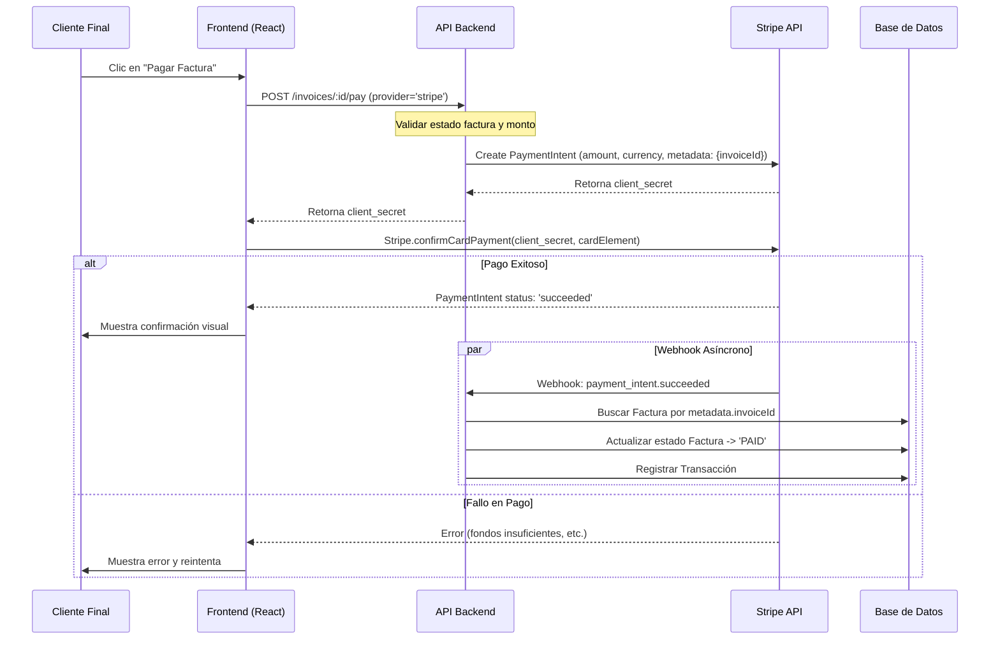

# Módulo 7: Facturación & Tesorería (Invoicing & Treasury)

Este documento define las especificaciones técnicas y funcionales para el módulo de Facturación y Tesorería del CRM.

## 1. Descripción General

El objetivo de este módulo es automatizar el flujo de cobro ("Cashflow") y reducir la fricción en la gestión financiera del freelancer. Se centra en la generación automática de facturas basadas en hitos de proyecto o recurrencia, la facilitación del pago mediante pasarelas integradas y la proyección financiera a corto/medio plazo.

## 2. Arquitectura de Implementación

Todo el código relacionado con este módulo debe residir bajo la siguiente estructura de directorios, siguiendo la arquitectura "Feature-First":

```
src/features/invoicing/
├── api/           # Definiciones de endpoints, hooks de React Query (useInvoices, useCreateInvoice, etc.)
├── components/    # Componentes de UI específicos (InvoiceCard, PaymentGatewayIntegration, CashflowChart)
├── pages/         # Páginas de enrutamiento (InvoiceList, InvoiceDetail, TreasuryDashboard)
├── types/         # Tipos TypeScript específicos (Invoice, PaymentMethod, Transaction)
└── utils/         # Utilidades para cálculo de impuestos, formateo y generación de series
```

## 3. Funcionalidades Clave

### 3.1. Facturación Inteligente (Smart Invoicing)

El sistema debe ser capaz de generar facturas automáticamente basándose en eventos del sistema (Módulo 4: Proyectos) o en cronogramas definidos.

*   **Facturas de Hito (Milestone Invoices):**
    *   **Trigger:** Completitud de un Hito en el módulo de Proyectos.
    *   **Lógica:** Al marcar un hito como "Completado", el sistema debe preguntar o generar automáticamente un borrador de factura con el importe asociado a ese hito.
    *   **Datos:** Debe heredar los datos de facturación de la entidad (Cliente) asociada al proyecto.

*   **Retainers (Igualas / Recurrentes):**
    *   **Configuración:** Definición de frecuencia (mensual, trimestral), día de emisión (ej. día 1 de cada mes) y concepto base.
    *   **Automatización:** Job o función programada que genera y envía la factura automáticamente en la fecha configurada.

*   **Recordatorios de Impago (Dunning Management):**
    *   **Secuencia:** Configurable (ej. Día +3: Recordatorio amable; Día +15: Reclamación firme; Día +45: Aviso legal).
    *   **Estado:** Debe trackear el estado de visualización del correo/factura.

### 3.2. Pasarela de Pagos Integrada

Integración con proveedores de pago para facilitar el cobro inmediato ("Click-to-Pay").

*   **Interfaz de Pago:**
    *   Botón "Pagar Ahora" visible tanto en la vista web de la factura como en el PDF generado.
    *   Debe redirigir a una página de checkout segura o abrir un modal de pago.

*   **Proveedores Soportados:**
    *   **Stripe/PayPal:** Para pagos con tarjeta.
    *   **Wise:** Para transferencias internacionales.
    *   **Transferencia Bancaria:** Debe mostrar los datos bancarios (IBAN/SWIFT).
        *   *Conciliación Automática:* Lógica para escanear conceptos bancarios y marcar facturas como "Pagadas" automáticamente (si la API bancaria lo permite o mediante importación de extractos).

### 3.3. Previsión de Flujo de Caja (Cashflow Forecast)

Herramienta visual para la toma de decisiones financieras.

*   **Visualización (Gráfico):**
    *   Eje X: Tiempo (vista a 90 días).
    *   Eje Y: Importe Monetario.
    *   **Series de Datos:**
        1.  **Dinero Real:** Saldo actual en cuentas bancarias.
        2.  **Cobros Pendientes:** Facturas emitidas no vencidas (ponderadas por probabilidad de cobro si aplica).
        3.  **Gastos Previstos:** Suscripciones recurrentes (Módulo 14), impuestos estimados (Módulo 9) y gastos fijos.
*   **Proyección:** Cálculo del saldo proyectado en fecha futura (Saldo Actual + Cobros Previstos - Gastos Previstos).

## 4. Lógica de Negocio Avanzada

### 4.1. Numeración de Facturas (Series)

Para garantizar la integridad y el cumplimiento legal, la numeración de las facturas sigue una lógica estricta basada en **Series**.

*   **Estructura de Serie:** `[PREFIJO]-[AÑO]-[SECUENCIAL]` (Ej: `INV-2024-0001`).
*   **Gestión de Múltiples Series:**
    *   *Serie General:* Para facturación estándar.
    *   *Serie Rectificativa:* Para abonos o correcciones (Ej: `RECT-2024-0001`).
    *   *Series Personalizadas:* Posibilidad de crear series por país o línea de negocio.
*   **Secuencialidad:**
    *   El número secuencial debe ser único e incrementarse atómicamente dentro de una misma serie y año fiscal.
    *   Al cambiar de año fiscal, el secuencial se reinicia a 1 (configurable).

### 4.2. Generación de PDF

La generación de documentos PDF se realiza en el cliente (browser) para previsualización rápida y en el servidor (opcional) para envío por correo.

*   **Librerías:** Se utilizará **`@react-pdf/renderer`** para definir las plantillas de factura como componentes de React, permitiendo reutilizar la lógica de UI y asegurar consistencia visual.
*   **Plantillas:**
    *   Header con logo y datos fiscales del emisor.
    *   Datos del cliente.
    *   Tabla de items con desglose.
    *   Bloque de totales e impuestos.
    *   Pie de página con datos registrales y términos de pago.

## 5. Integración con Stripe

El flujo de pago de una factura mediante Stripe utiliza *Payment Intents* para asegurar SCA (Strong Customer Authentication).



## 6. Modelo de Datos Detallado

El modelo de datos debe soportar situaciones fiscales complejas, incluyendo múltiples tipos de impuestos por línea (IVA, IRPF, Recargo de equivalencia).

```typescript
/**
 * Representa la estructura completa de una factura.
 */
interface Invoice {
  id: string;
  
  // Numeración
  series: string;         // Ej: "F-2025"
  number: number;         // Ej: 145
  full_number: string;    // Ej: "F-2025-0145" (Generado/Calculado)
  
  // Relaciones
  project_id?: string;
  client_id: string;
  issuer_id: string;      // ID del perfil fiscal del freelancer

  // Fechas
  date_issued: string;    // ISO 8601
  date_due: string;       // ISO 8601
  date_paid?: string;     // ISO 8601 (si aplica)

  // Estado
  status: 'draft' | 'sent' | 'viewed' | 'paid' | 'partial' | 'overdue' | 'cancelled';
  currency: string;       // ISO 4217 (EUR, USD)

  // Contenido
  items: InvoiceItem[];
  notes?: string;
  terms_conditions?: string;

  // Totales Calculados
  subtotal: number;       // Suma de base imponible de items
  total_tax: number;      // Suma total de impuestos
  total: number;          // Subtotal + Total Impuestos
  balance_due: number;    // Total - Pagos realizados (para pagos parciales)

  // Desglose de impuestos para visualización
  tax_summary: TaxSummary[]; 
}

/**
 * Línea individual de la factura.
 */
interface InvoiceItem {
  id: string;
  description: string;
  quantity: number;
  unit_price: number;
  discount_amount?: number; // Descuento fijo por línea
  
  // Impuestos aplicables a esta línea específica
  applied_taxes: TaxDefinition[]; 
  
  // Totales de línea
  line_subtotal: number; // (qty * unit_price) - discount
  line_total: number;    // line_subtotal + impuestos de línea
}

/**
 * Definición de un impuesto.
 * Permite IRPF (negativo) e IVA (positivo).
 */
interface TaxDefinition {
  id: string;
  name: string;           // Ej: "IVA General", "IRPF Retención"
  rate: number;           // Ej: 21.00, -15.00
  type: 'percentage' | 'fixed';
  is_retention: boolean;  // True si resta del total (ej. IRPF en España)
}

/**
 * Resumen agrupado de impuestos para el pie de factura.
 */
interface TaxSummary {
  tax_name: string;
  rate: number;
  base_amount: number;    // Base imponible sobre la que aplica este impuesto
  tax_amount: number;     // Importe calculado del impuesto
}

/**
 * Registro de transacciones asociadas a la factura.
 */
interface InvoiceTransaction {
  id: string;
  invoice_id: string;
  date: string;
  amount: number;
  gateway: 'stripe' | 'paypal' | 'bank_transfer' | 'cash';
  reference_id?: string;  // Stripe PaymentIntent ID, etc.
  status: 'pending' | 'success' | 'failed';
}
```

## 7. Requisitos No Funcionales

*   **Seguridad:** Los datos de pago sensibles NO deben almacenarse en la base de datos local (usar tokenización de Stripe/PayPal).
*   **Auditabilidad:** Todo cambio de estado en una factura (creación, envío, visualización, pago) debe quedar registrado en un log de auditoría.
*   **Inmutabilidad:** Una vez que una factura está en estado "Sent" o "Paid", no debe ser modificable. Cualquier error requiere la emisión de una factura rectificativa.
*   **Exportación:** Capacidad de generar PDFs profesionales y cumplir con normativas de facturación electrónica (donde aplique).