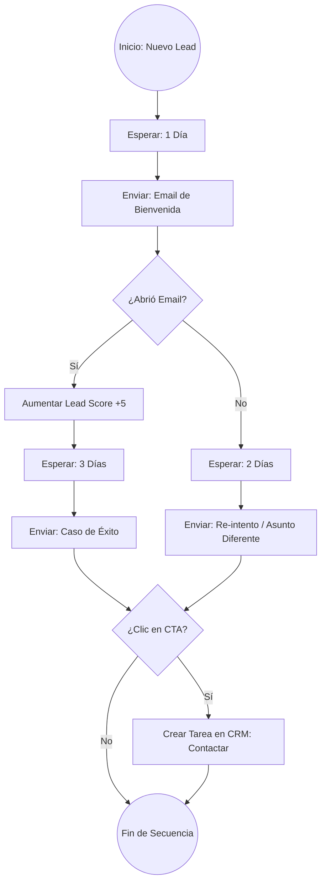

# Módulo 2: Marketing Personal & Campañas

## Visión General
**Objetivo:** Generar demanda y gestionar la marca personal sin requerir conocimientos avanzados de marketing. Este módulo permite al freelancer crear páginas de aterrizaje, gestionar campañas de email hiper-personalizadas y planificar contenido para redes sociales.

## Especificaciones Funcionales

### 2.1. Generador de Landing Pages (Micro-Servicios)
Permite la creación rápida de páginas de venta para servicios específicos.
- **Constructor Visual:** Interfaz simplificada para definir bloques de contenido.
- **Hosting:** Generación de rutas amigables (ej. `usuario.com/oferta-especial`).
- **Pagos:** Integración nativa con Stripe para checkout directo en la landing.

### 2.2. Email Marketing de Francotirador
Sistema enfocado en calidad sobre cantidad, diseñado para nutrición de leads de alto valor.
- **Secuencias Drip:** Editor de flujos de correos automatizados.
- **Tracking:** Monitoreo de aperturas y clics con notificación directa al Módulo 1 (CRM).

### 2.3. Gestor de Contenido (Content Calendar)
Herramienta para la planificación y reutilización de contenido en redes sociales.

## Flujo de Automatización (Email Drip)

El siguiente diagrama representa el flujo lógico de una campaña de "Goteo" (Drip Campaign) típica para nutrir leads.



## Estructura de Datos: Landing Page

Ejemplo de estructura JSON para persistir una Landing Page completa, incluyendo configuración de tema y bloques de contenido.

```json
{
  "id": "lp_uuid_v4",
  "slug": "auditoria-seo-express",
  "status": "published",
  "meta": {
    "title": "Auditoría SEO en 24h",
    "description": "Mejora tu ranking en Google con un análisis rápido.",
    "ogImage": "https://assets.example.com/seo-audit.jpg"
  },
  "theme": {
    "primaryColor": "#4F46E5",
    "fontFamily": "Inter, sans-serif",
    "buttonStyle": "rounded-full"
  },
  "blocks": [
    {
      "id": "b_hero_01",
      "type": "hero",
      "data": {
        "headline": "Tu sitio web merece más tráfico",
        "subheadline": "Identifico los 3 errores críticos que frenan tu crecimiento.",
        "ctaText": "Quiero mi auditoría",
        "backgroundImage": "url_to_bg_image"
      }
    },
    {
      "id": "b_features_02",
      "type": "features_list",
      "data": {
        "items": [
          { "icon": "speed", "text": "Análisis de Velocidad" },
          { "icon": "mobile", "text": "Ux Móvil" },
          { "icon": "content", "text": "Gap de Contenido" }
        ]
      }
    },
    {
      "id": "b_checkout_03",
      "type": "stripe_checkout",
      "data": {
        "priceId": "price_stripe_id_123",
        "buttonLabel": "Comprar por $99"
      }
    }
  ],
  "createdAt": "2023-10-27T10:00:00Z",
  "updatedAt": "2023-11-01T15:30:00Z"
}
```

## Arquitectura Técnica e Implementación

**IMPORTANTE:** Toda la implementación de este módulo debe residir exclusivamente en `src/features/marketing/`.

### Componentes UI Necesarios

Se requiere desarrollar los siguientes componentes reutilizables y vistas:

1.  **`LandingBuilder`**: Componente principal ("lienzo") que gestiona el estado de la landing page (DnD Context).
    *   `BlockSelector`: Sidebar para elegir tipos de bloques (Hero, Testimonios, Pricing).
    *   `PropertyEditor`: Panel lateral derecho para editar las propiedades del bloque seleccionado (texto, colores).
    *   `PreviewDevice`: Vista previa responsiva (Móvil/Tablet/Desktop).

2.  **`EmailEditor`**: Editor WYSIWYG o de bloques para correos.
    *   Debe soportar variables dinámicas (ej. `{{contact.firstName}}`).
    *   Debe generar HTML compatible con clientes de correo (Outlook, Gmail).

3.  **`DripVisualizer`**:
    *   Visualización del flujo de emails (similar al diagrama Mermaid pero interactivo).
    *   Permite añadir nodos de "Espera" o "Email".

### Estructura de Directorios Actualizada

```
src/features/marketing/
├── pages/
│   ├── LandingPageBuilder.tsx  # Página principal del constructor
│   ├── EmailCampaigns.tsx      # Lista y gestión de campañas
│   ├── CampaignDetail.tsx      # Edición de flujo Drip y métricas
│   └── ContentCalendar.tsx     # Vista de calendario
├── components/
│   ├── builder/                # Componentes específicos del Landing Builder
│   │   ├── Canvas.tsx
│   │   ├── BlockSidebar.tsx
│   │   └── InspectorPanel.tsx
│   ├── email/
│   │   ├── EmailEditor.tsx     # Editor de contenido de email
│   │   └── NodeFlow.tsx        # Visualizador de flujo (React Flow o similar)
│   └── shared/
│       └── AssetPicker.tsx     # Selector de imágenes/archivos
├── api/
│   ├── marketingService.ts
│   └── providerAdapter.ts      # Interfaz para servicios de email
└── types/
    └── marketing.ts
```

### API Endpoints

Diseño de la API RESTful para soportar el frontend:

| Método | Endpoint | Descripción |
| :--- | :--- | :--- |
| **POST** | `/api/v1/marketing/landings` | Crear una nueva landing page. |
| **PUT** | `/api/v1/marketing/landings/:id` | Guardar cambios en el JSON de la landing. |
| **GET** | `/api/v1/marketing/landings/:slug` | Obtener datos públicos para renderizar la landing. |
| **POST** | `/api/v1/marketing/campaigns` | Crear campaña de email. |
| **GET** | `/api/v1/marketing/campaigns/:id/stats` | Obtener métricas (open rate, click rate). |
| **POST** | `/api/v1/marketing/email/preview` | Enviar correo de prueba a uno mismo. |
| **POST** | `/api/v1/marketing/webhook/stripe` | Webhook para confirmar pagos y disparar acciones. |

### Integración con Proveedores de Email

El sistema debe ser agnóstico al proveedor de envío de correos. Se implementará un patrón **Adapter**.

1.  **Interfaz (`IEmailProvider`):**
    *   `sendEmail(to, subject, bodyHtml, options)`
    *   `getTemplateStatus(templateId)`

2.  **Implementaciones Soportadas:**
    *   **SMTP (Nodemailer):** Para uso genérico y bajo coste inicial. Configurable mediante variables de entorno (`SMTP_HOST`, `SMTP_USER`, `SMTP_PASS`).
    *   **API (Resend / SendGrid / AWS SES):** Para mayor escalabilidad y entregabilidad. Se prefiere integración vía API REST para mejor manejo de errores y webhooks de eventos (bounce, complain).

3.  **Manejo de Colas:**
    *   El envío de correos masivos o secuencias drip debe gestionarse a través de una cola de tareas (ej. BullMQ o simple DB-queue) para no bloquear el thread principal y manejar reintentos (retries) ante fallos del proveedor.