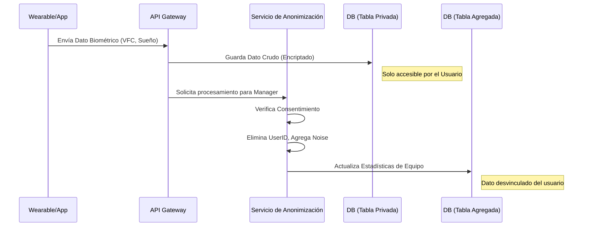

# Módulo 1: La Fortaleza de Privacidad y Gobernanza (Arquitectura de Confianza)

## 1. Visión General Técnica & Filosofía de Seguridad
Este módulo implementa una arquitectura **Zero-Trust** a nivel de aplicación. No confiamos en que el frontend filtre los datos; el backend debe imponer restricciones a nivel de Row-Level Security (RLS) y Column-Level Encryption. El objetivo es garantizar el cumplimiento estricto de GDPR, CCPA y normas laborales (ej. prohibición de discriminar por salud).

## 2. Diagrama de Flujo de Datos (Data Airlock)



## 3. Esquema de Base de Datos (PostgreSQL / Supabase)

Utilizaremos **RLS (Row Level Security)** para forzar la privacidad a nivel de motor de base de datos.

```sql
-- Tabla de Consentimientos
CREATE TABLE privacy_consents (
    user_id UUID PRIMARY KEY REFERENCES auth.users(id),
    allow_personal_analysis BOOLEAN DEFAULT TRUE,
    allow_team_aggregation BOOLEAN DEFAULT FALSE,
    allow_calendar_auto BOOLEAN DEFAULT FALSE,
    allow_health_alerts BOOLEAN DEFAULT FALSE,
    updated_at TIMESTAMPTZ DEFAULT NOW(),
    audit_version INTEGER DEFAULT 1
);

-- Tabla de Auditoría (Inmutable)
CREATE TABLE data_access_logs (
    id UUID DEFAULT gen_random_uuid() PRIMARY KEY,
    accessor_id UUID REFERENCES auth.users(id), -- Quién accedió (o NULL si fue sistema)
    target_user_id UUID, -- De quién es el dato (Hashed si es anonimizado)
    data_category TEXT NOT NULL, -- 'SLEEP', 'HRV'
    access_context TEXT NOT NULL, -- 'MANAGER_DASHBOARD', 'PERSONAL_VIEW'
    was_anonymized BOOLEAN NOT NULL,
    timestamp TIMESTAMPTZ DEFAULT NOW()
);

-- Política RLS (Ejemplo)
ALTER TABLE user_biometrics ENABLE ROW LEVEL SECURITY;

CREATE POLICY "Users can only see their own raw data"
ON user_biometrics
FOR SELECT
USING (auth.uid() = user_id);

CREATE POLICY "Managers can NEVER see raw data"
ON user_biometrics
FOR SELECT
TO manager_role
USING (false); -- Deny all
```

## 4. Interfaces TypeScript & Lógica de Negocio

### 4.1. Gestión de Consentimiento
```typescript
export type ConsentScope = 'PERSONAL' | 'TEAM' | 'AUTO' | 'MEDICAL';

export interface PrivacySettings {
    scopes: Record<ConsentScope, boolean>;
    retentionPolicy: {
        raw_data_days: number; // Ej: 30 días
        aggregated_data_months: number; // Ej: 12 meses
    };
}
```

### 4.2. Algoritmo de "K-Anonymity" (Implementación Lógica)
Antes de devolver datos a un manager, el servicio debe validar:

```typescript
async function getTeamMetrics(teamId: string, managerId: string) {
    // 1. Contar miembros activos con consentimiento 'TEAM' activo
    const activeMembers = await db.users.count({
        where: { teamId, consent_team_aggregation: true }
    });

    // 2. Regla Dura: K-Anonymity Threshold
    const MIN_ANONYMITY_THRESHOLD = 5;
    
    if (activeMembers < MIN_ANONYMITY_THRESHOLD) {
        throw new PrivacyError(
            `PROTECTED_VIEW: Insufficient data points (${activeMembers}/${MIN_ANONYMITY_THRESHOLD}). Privacy cannot be guaranteed.`
        );
    }

    // 3. Obtener datos y aplicar recorte de extremos (Winsorizing)
    const rawMetrics = await db.metrics.find({ teamId });
    const sanitizedMetrics = winsorize(rawMetrics, 0.05); // Recorta top/bottom 5%

    return calculateAggregates(sanitizedMetrics);
}
```

## 5. Endpoints y Seguridad API

### Endpoints
*   `POST /api/privacy/kill-switch`: **Critical Path**.
    1.  Verifica contraseña del usuario (Re-auth).
    2.  Ejecuta transacción SQL:
        *   `DELETE FROM user_biometrics WHERE user_id = X`
        *   `UPDATE users SET active = false WHERE id = X`
        *   `INSERT INTO audit_log (action: 'ACCOUNT_NUKE')`
    3.  Dispara evento a proveedores externos (Oura/Whoop) para revocar tokens.

### Encriptación
*   **En Tránsito:** TLS 1.3 obligatorio.
*   **En Reposo:** Columnas sensibles (ej. notas médicas del BioCoach) deben usar encriptación simétrica en DB (`pgcrypto` -> `pgp_sym_encrypt`).

## 6. Plan de Pruebas (QA Strategy)

*   **Unit Tests:** Verificar que la función `getTeamMetrics` lanza error con 4 usuarios.
*   **Integration Tests:** Simular un usuario revocando consentimiento y verificar que sus datos dejan de influir en el promedio del equipo inmediatamente.
*   **Security Audit:** Intentar acceder a `/api/biometrics/raw` con un token de Manager (Debe devolver 403 Forbidden).

## 7. Estructura de Archivos (Expandida)

```text
src/features/peak-performance/privacy/
├── api/
│   ├── privacyService.ts
│   └── auditService.ts         # Servicio de logging inmutable
├── components/
│   ├── Airlock/
│   │   ├── DataAirlockAnimation.tsx # Canvas animation
│   │   └── PrivacyShieldIcon.tsx
│   ├── Consent/
│   │   ├── GranularConsentForm.tsx
│   │   └── DataRetentionSlider.tsx
│   ├── Audit/
│   │   ├── AccessLogTable.tsx
│   │   └── ExportDataButton.tsx # GDPR Download
├── context/
│   └── PrivacyPolicyContext.tsx
├── guards/
│   └── RequireConsentGuard.tsx # HOC para proteger rutas
├── lib/
│   └── cryptoUtils.ts          # Helpers para hashing client-side si necesario
└── pages/
    ├── PrivacyDashboard.tsx
    └── DataDeletionRequestPage.tsx
```
