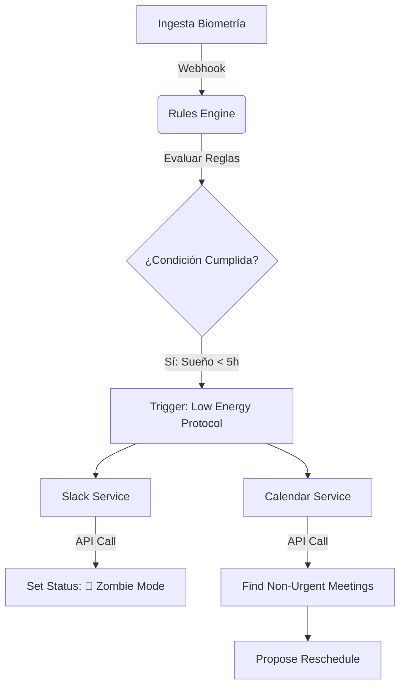

# Módulo 4: El Puente de Automatización y Bio-Scheduler

## 1. Visión General Técnica
Este módulo actúa como un "agente" que negocia en nombre del usuario. La complejidad reside en la gestión de tokens OAuth, manejo de límites de tasa (Rate Limiting) de las APIs de Google/Microsoft, y la lógica de "fallback" cuando no se pueden mover reuniones.

## 2. Integraciones y Scopes (OAuth2)

### Google Calendar API
*   **Scopes Requeridos:**
    *   `https://www.googleapis.com/auth/calendar.events` (Lectura/Escritura)
    *   `https://www.googleapis.com/auth/calendar.readonly` (Para leer busy/free)
*   **Estrategia:** Usar "Incremental Authorization" para pedir permisos solo cuando se activa la feature.

### Slack API
*   **Scopes:**
    *   `users.profile:write` (Para cambiar estado/emoji)
    *   `dnd:write` (Para activar "Do Not Disturb")
*   **Bot User:** Implementar como una Slack App instalable en el workspace.

## 3. Arquitectura de Automatización (Event-Driven)



## 4. Algoritmos de "Smart Rescheduling"

### Lógica de Identificación de Reuniones "Movibles"
El sistema debe analizar los metadatos del evento (`calendar.events.list`):
1.  **¿Soy el organizador?** Si no, no puedo moverla fácilmente (solo declinar).
2.  **¿Número de asistentes?** Si > 3, coste de coordinación es alto -> No mover automáticamente.
3.  **¿Es recurrente?** (ej. Daily Standup). Generalmente inamovible.
4.  **¿Keywords en título?** "Urgent", "Client", "Board" -> Inamovible. "Sync", "Coffee", "Check-in" -> Movible.

### Manejo de Errores y Retries
*   Las APIs de calendario suelen fallar o tener latencia.
*   Implementar **Exponential Backoff** para los intentos de escritura.
*   **Transactional Integrity:** Si falla la actualización en Slack pero pasó en Calendar, ¿qué hacemos? (Best effort, log error).

## 5. UI de Configuración (Frontend)

### `AutoBlockingSettings.tsx`
Debe ofrecer control granular para evitar frustración:
*   [Check] Bloquear automáticamente horas de foco.
    *   Max horas/día: [ 2 ]
    *   Solo si mi energía es > [ 70% ]
*   [Check] Rechazar reuniones si mi recuperación es crítica (<30%).
    *   Respuesta automática: "No estoy al 100%, reagendemos."

## 6. Estructura de Archivos (Expandida)

```text
src/features/peak-performance/automation/
├── api/
│   ├── googleCalendarClient.ts # Wrapper tipado
│   ├── outlookClient.ts
│   ├── slackClient.ts
│   └── tokenManager.ts         # Refresh token logic
├── components/
│   ├── Onboarding/
│   │   ├── IntegrationCard.tsx # Connect button con estado
│   │   └── ScopePermissionModal.tsx
│   ├── Logs/
│   │   ├── AutomationHistoryTable.tsx # "Ayer bloqueamos 2h de foco"
│   │   └── ActionRollbackButton.tsx   # "Deshacer cambios de hoy"
├── logic/
│   ├── meetingClassifier.ts    # Heurística para detectar importancia
│   └── timeSlotOptimizer.ts    # Algoritmo de Tetris para agenda
└── pages/
    ├── IntegrationsPage.tsx
    └── RulesConfigPage.tsx
```
